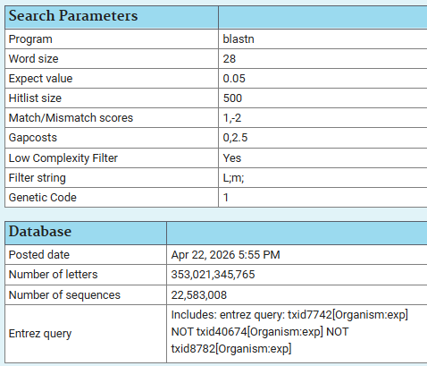
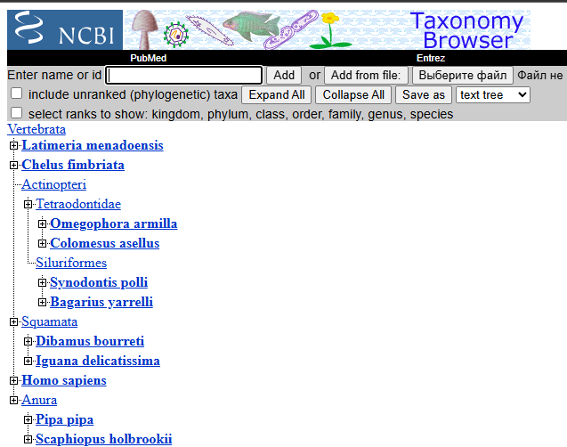

## 2. Выбранный ген
MT-CO1

## 3. Параметры BLAST

## 4. Найденные гомологичные гены

| Gene Symbol | Вид, латинское название | Русское название |
|-------------|-------------------------|------------------|
| MT-CO1 | *Homo sapiens* | человек разумный |
| COX1 | *Latimeria menadoensis* | индонезийская латимерия |
| Cox1 | *Bagarius yarrelli* | гангский багарий |
| COX1 | *Synodontis polli* | синодонтис Полла |
| COX1 | *Chelus fimbriata* | 	бахромчатая черепаха, матамата ||
| COX1 | *Omegophora armilla* | кольчатый фугу |
| COX1 | *Colomesus asellus* | 	южноамериканский пресноводный фугу |
| COX1 | *Iguana delicatissima* | малые антильские игуаны |
| COX1 | *Pipa pipa* | суринамская пипа |
| COX1 | *Dibamus bourreti* | дибамус Бурре |
| COX1 | *Scaphiopus holbrookii* | восточная лопатоногая чесночница |

## 5. Множественное выравнивание

Файл множественного выравнивания в формате Clustal: [`MT-CO1_alignment.clustal`](MT-CO1_alignment.clustal).

## 6. Анализ консервативности

В множественном выравнивании сравнивались последовательности гена MT-CO1/COX1 у человека и 10 гомологичных последовательностей позвоночных. Длина выравнивания составила 1560 позиций. В выравнивании присутствует много консервативных колонок: 866 позиций полностью совпадают у всех последовательностей, а 1067 позиций имеют один и тот же нуклеотид минимум у 80% видов.

Сходство с человеческой последовательностью у выбранных видов находится примерно в диапазоне 76-78%. Наиболее близкой среди выбранных последовательностей оказалась Latimeria menadoensis, около 78.1% совпадений с MT-CO1 человека. Остальные виды имеют сопоставимый уровень сходства, что ожидаемо, поскольку в выборке представлены рыбы, амфибии и рептилии, то есть достаточно далекие от человека позвоночные.

Большое число совпадающих колонок показывает, что COX1 является консервативным митохондриальным геном. При этом в выравнивании есть и вариабельные участки, отражающие эволюционные различия между группами позвоночных.

## 7. Ближайший объединяющий таксон

Ближайший общий таксон для всех выбранных видов - Vertebrata(позвоночные).

Позвоночные - это группа хордовых животных, к которой относятся рыбы, амфибии, рептилии, птицы и млекопитающие. Для представителей этой группы характерны наличие позвоночника или его производных, черепа, развитой нервной системы и внутреннего скелета.
